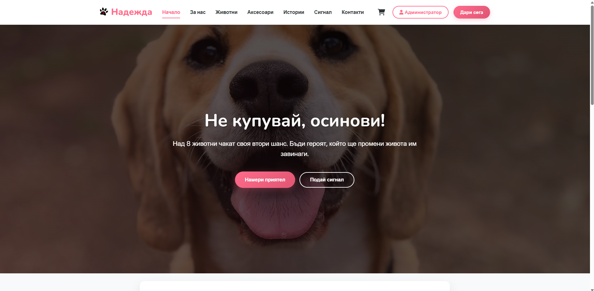
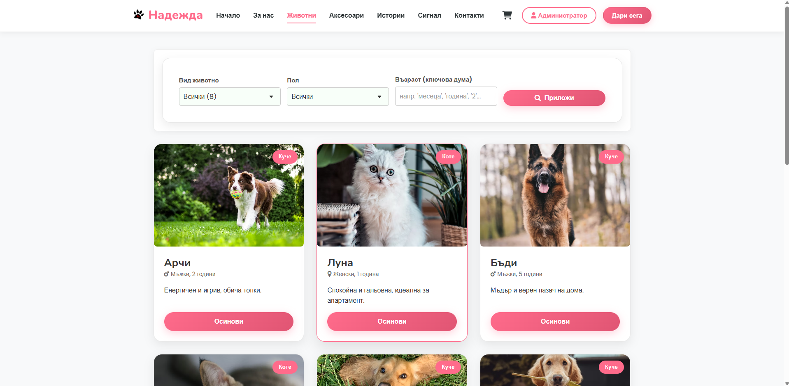
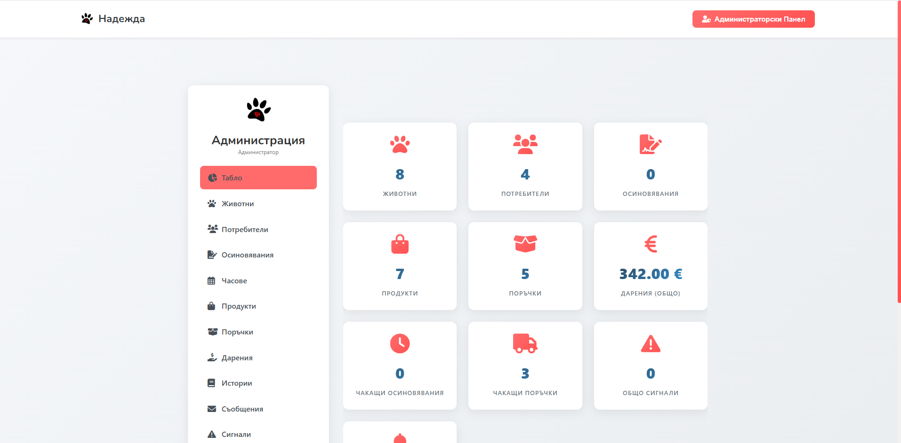

# 🐾 Приют "Надежда" - Електронна система за приют за животни и осиновяване
Този проект представлява комплексно уеб приложение, разработено като **дипломен проект**. Основната му цел е да подпомогне дейността на приют за животни чрез дигитализиране на процесите по осиновяване, набиране на средства (дарения) и продажба на аксесоари, с цел финансово подпомагане на приюта.

---

## ✨ Основни функционалности

Проектът е разделен на няколко основни модула, обслужващи различни типове потребители: **Гости (публична част)**, **Регистрирани потребители** и **Администратори**.

### 🌍 Публична част (За всички посетители)
* **Адаптивен дизайн (Responsive Design):** Сайтът изглежда и работи отлично на мобилни телефони, таблети и десктоп устройства.
* **Авторско лого:** Специално изработено лого, интегрирано в дизайна на сайта.
* **Структура от страници:**
  * `Начало` - Акценти, новини и бързи връзки.
  * `За нас` - Информация за мисията и екипа на приюта.
  * `Животни за осиновяване` - Каталог с опции за **филтриране по множество критерии**.
  * `Аксесоари` - Електронен магазин за продукти за животни.
  * `Дарения` - Информационна страница за подкрепа на каузата.
  * `Истории със щастлив край` - Блог/секция с успешни осиновявания.
  * `Сигнал` - Форма за подаване на сигнал за бездомни животни.
  * `Контакти` - Форма за връзка, карта и координати.

### 👤 Потребителски панел (Регистрирани потребители)
* **Сигурна автентикация:** * Регистрация и вход.
  * Изпращане на имейл за потвърждение на акаунта.
  * Възможност за "Забравена парола" и генериране на нова чрез имейл линк.
* **Профил и История:** Следене на историята на подадените заявки за осиновяване, направените поръчки на аксесоари и реализираните дарения.
* **Модул Осиновяване:** Подаване на онлайн заявление за осиновяване на конкретно животно.
* **Модул Посещения:** Запазване на ден и час за посещение на място в приюта.
* **Симулация на плащания (Stripe):** * Сигурно онлайн заплащане на поръчки за аксесоари чрез кредитна/дебитна карта.
  * Модул за онлайн дарения чрез Stripe.

### 🛡️ Административен панел (Пълен контрол)
* **CRUD за животни:** Добавяне на нови животни, редактиране на информацията, качване на снимки и промяна на статуса им.
* **Управление на потребители:** Преглед и актуализиране на информацията за регистрираните потребители.
* **Обработка на заявки:** Преглед, одобряване или отхвърляне на подадените заявления за осиновяване и резервациите за посещение.
* **Управление на е-магазин:** Обработка на постъпилите поръчки за аксесоари и промяна на статуса им.
* **Следене на дарения:** Администриране и проследяване на постъпилите финансови средства.

---

## 🛠️ Използвани технологии (Tech Stack)

**Frontend:**
* HTML
* CSS
* JavaScript
* Tailwind CSS / Bootstrap за адаптивен дизайн
* PHP

**Backend:**
* PHP, PhpMyAdmin
* База данни: MySQL
* PHPMailer

**Сигурност и Плащания:**
* **Stripe API:** Интеграция за симулация на картови разплащания в тестова среда.

## 📸 Екранни снимки (Screenshots)

**Начална страница:**

**Каталог животни:**

**Административен панел:**

---
Разработено с ❤️ за животните.